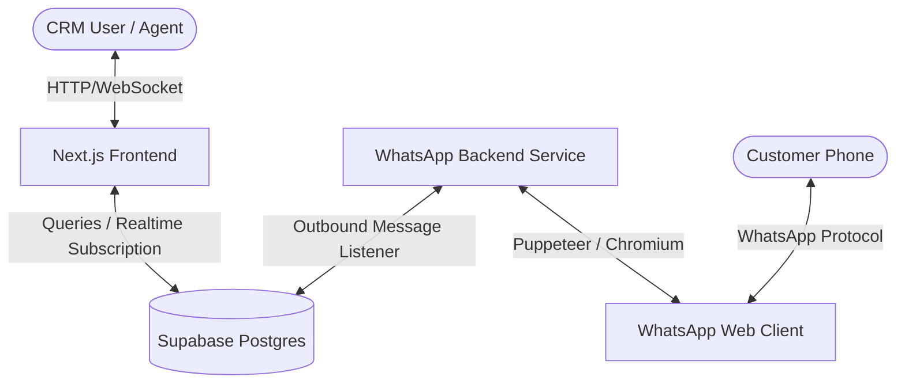

# Sampark Desk — Premium CRM for WhatsApp

Sampark Desk is a premium, self-hostable CRM for WhatsApp. Built with **Next.js 16 (App Router)**, **Supabase (Postgres + Realtime + RLS)**, and a custom **Node.js WhatsApp service** using `whatsapp-web.js` (Puppeteer), it provides a complete shared team inbox, sales pipelines (Kanban), contact management, broadcasts, and no-code visual automations.

---

## 🌟 Key Features

* 📥 **Shared Team Inbox**: Multiple agents can collaborate on a single WhatsApp number. Supports real-time typing indicators, read receipts, text/image messages, assignments, status updates (`open`, `pending`, `closed`), and internal contact notes.
* 👥 **Contact Management**: Stores customer metadata, tags, and custom fields. Automatically normalizes JIDs and displays contact pushnames or phone numbers.
* 📊 **Sales Pipelines (Kanban)**: Track leads and deals through custom stages. Link deals directly to WhatsApp conversation threads.
* 📢 **Meta-style Broadcasts**: Draft templates with dynamic user parameters and schedule/send broadcast campaigns.
* 🤖 **No-Code Visual Automation Engine**: Build rules triggered by inbound events (e.g. keywords, new contact creation, first message) to auto-assign agents, send replies, wait, or trigger webhooks.
* 📈 **Real-Time Dashboard**: Monitor response times, active threads, pipeline metrics, and daily activity feeds.

---

## 🏗️ System Architecture

Sampark Desk separates concerns between the web UI and the WhatsApp connectivity layer:



1. **Frontend (Next.js)**: Performs data operations directly on Supabase. Subscribes to Supabase Realtime channels to update the inbox and dashboard instantly when database changes occur.
2. **Database (Supabase)**: Enforces Row-Level Security (RLS) policies on every table based on the logged-in user's UID (`auth.uid() = user_id`).
3. **Backend Service (`/whatsapp-service`)**: Connects to WhatsApp Web using Puppeteer. 
   * **Inbound**: Listens for messages, resolves contact profiles, normalizes JIDs to standard format, writes records to Supabase, and triggers automations.
   * **Outbound**: Subscribes to the `messages` table and sends pending outbound messages immediately.

---

## 📦 Database Schema Quick Reference

All Postgres tables and security policies are declared in `supabase/migrations/001_initial_schema.sql`:

| Table Name | Description | Key Columns |
| :--- | :--- | :--- |
| `profiles` | CRM Agent User profile | `id` (references auth.users), `name`, `email` |
| `whatsapp_config` | WhatsApp session credentials | `user_id`, `status` (`connected`, `qr_ready`, etc), `qr_code` (base64) |
| `contacts` | Customer information | `id`, `user_id`, `phone` (normalized JID), `name` |
| `conversations` | Discussion threads | `id`, `contact_id`, `status` (`open`, `pending`, `closed`), `last_message_text` |
| `messages` | Chat history | `id`, `conversation_id`, `sender_type` (`customer`, `agent`, `bot`), `status` |
| `pipelines` / `stages` | Kanban board definitions | `id`, `name`, `user_id` |
| `deals` | Financial deals | `id`, `stage_id`, `conversation_id`, `value` |
| `automations` | Workflow rules | `id`, `name`, `trigger_type` |

---

## 🚀 Quick Start (Local Setup)

### 1. Configure Environment (`.env.local`)
Create a `.env.local` file in the root directory:
```env
NEXT_PUBLIC_SUPABASE_URL=https://your-project-ref.supabase.co
NEXT_PUBLIC_SUPABASE_ANON_KEY=your-anon-key
SUPABASE_SERVICE_ROLE_KEY=your-service-role-key
NEXT_PUBLIC_APP_URL=http://localhost:3000
DB_PASSWORD=your-database-password
```

### 2. Install Dependencies
In the root directory, run:
```bash
npm install
```
In the `whatsapp-service` directory, run:
```bash
cd whatsapp-service
npm install
```

### 3. Run the Next.js Frontend
From the root directory:
```bash
npm run dev
```
Open [http://localhost:3000](http://localhost:3000) in your browser.

### 4. Run the WhatsApp Backend Service
In a separate terminal, from the `whatsapp-service` directory:
```bash
node index.js
```
The service will boot, authenticate using saved session keys, or output a QR code to the `whatsapp_config` table for you to scan in the Settings page of the CRM.

---

## 🔄 Core Data Flows

### Inbound Message Flow
1. **Receive**: Message is received by `whatsapp-web.js`.
2. **Normalize**: The sender's JID is parsed (e.g. `280530654388315@lid` -> phone user `919430357129` -> `919430357129@c.us`). A 2.5-second timeout wrapper prevents Puppeteer from stalling on un-synced contacts.
3. **Database Write**: The Node service writes or updates the `contacts`, `conversations`, and `messages` tables.
4. **UI Update**: Supabase Realtime detects the database insert and instantly pushes it to the agent's screen.
5. **Automations**: The Node service invokes the automation webhook `/api/automations/engine` to process keyword matches, automatic tags, or auto-replies.

### Outbound Message Flow
1. **Insert**: The agent clicks **Send** in the UI, inserting a message row with status `sending`.
2. **Catch**: The Node service's real-time PostgreSQL subscriber catches the new row.
3. **Send**: The service calls `client.sendMessage(toPhone, msg.content_text)`.
4. **Confirm**: On success, the row status is updated to `sent` along with the WhatsApp `message_id`.

---

## 🛠️ Customization & Modification Guide

### Adding New Fields to Contacts
To store additional data (like customer address or account value):
1. Add the column to the `contacts` table in Supabase.
2. Update the query in `src/components/inbox/conversation-list.tsx` to include the new field.
3. Add form inputs to edit the contact details in `src/components/inbox/message-thread.tsx` (the side drawer panel).

### Modifying Automation Workflows
* **Frontend Builder**: Edit `src/components/automations/action-node.tsx` to add UI blocks.
* **Execution Engine**: Edit `src/lib/automations/engine.ts`. The automation engine runs sequentially; you can insert custom node handlers here (e.g. sending data to external webhooks, sending Slack notifications, or updating Deal stages).

---

## 🧹 Maintenance & Troubleshooting

### Clearing Session Locks (Windows)
If you restart the WhatsApp service and it gets stuck after `Client authenticated` without ever reaching `Client is ready`, an orphaned Chrome process is holding a file lock on the session cache.
To kill the blocking processes safely in Windows PowerShell:
```powershell
Get-CimInstance Win32_Process -Filter "Name = 'chrome.exe'" | Where-Object { $_.CommandLine -like "*whatsapp-service*" } | ForEach-Object { Stop-Process -Id $_.ProcessId -Force -ErrorAction SilentlyContinue }
```

### Full Cache Reset
If the session becomes permanently corrupted or WhatsApp logs you out:
1. Disconnect the account in the CRM Settings page.
2. Delete the temporary authentication cache directories:
   * `whatsapp-service/.wwebjs_auth`
   * `whatsapp-service/.wwebjs_cache`
3. Restart the Node backend service and scan the new QR code.
