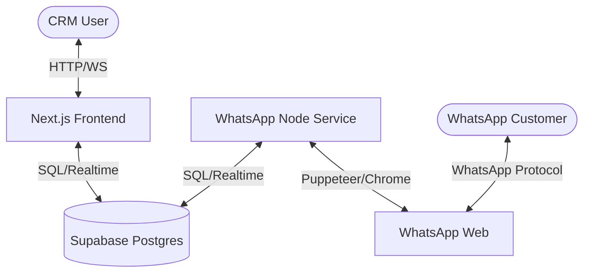
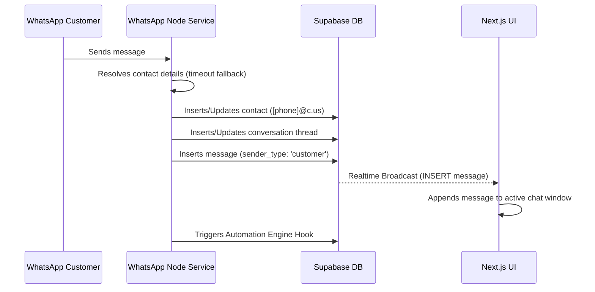
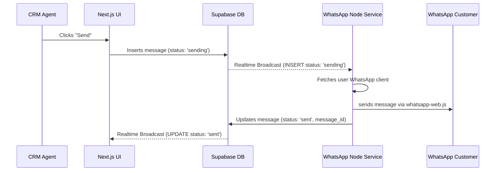

# TECHNICAL_README.md — Sampark Desk Architecture & Development Guide

Sampark Desk is a self-hostable CRM for WhatsApp designed to provide a shared team inbox, sales pipelines, contact management, broadcasts, and no-code automations. 

This guide details the internal working of the project so that you can modify, extend, and deploy it successfully.

---

## 1. System Architecture

The application is split into three main parts:



1. **Next.js Frontend (App Router)**:
   * Serves the visual dashboard, shared inbox, Kanban pipelines, and automation builder.
   * Connects directly to Supabase via `@supabase/supabase-js` for queries, mutations, and real-time subscription.
2. **Supabase Database & Realtime**:
   * Uses PostgreSQL for relational storage.
   * Row-Level Security (RLS) is enabled on all tables, ensuring users only see their own workspace data.
   * Realtime engine broadcasts table insertions/updates to the frontend and backend service.
3. **Unofficial WhatsApp Node Service (`/whatsapp-service`)**:
   * A standalone Node.js process that uses `whatsapp-web.js` to control a headless Chrome instance.
   * Bypasses the official Business Cloud API by simulating a WhatsApp Web client (requires scanning a QR code once).
   * Runs continuously in the background, listening to incoming WhatsApp events and Supabase outbound queues.

---

## 2. Database Schema

All database definitions are configured in `supabase/migrations/001_initial_schema.sql`. Here are the primary tables:

### Core Tables
* **`profiles`**: User profiles corresponding to `auth.users`.
* **`whatsapp_config`**: Stores credentials and connection status (`connected`, `qr_ready`, `disconnected`) for the WhatsApp session.
* **`contacts`**: Stores customer details. Normalised phone numbers (`[phone]@c.us`) serve as standard JIDs.
* **`conversations`**: Tracks message threads. Linked 1:1 to contacts. Tracks `status` (`open`, `pending`, `closed`), `unread_count`, and the `last_message_text`.
* **`messages`**: Stores individual messages. Tracks `sender_type` (`customer`, `agent`, `bot`), `content_type` (`text`, `image`), and `status` (`sending`, `sent`, `delivered`, `failed`).

### CRM Tables
* **`tags` & `contact_tags`**: CRM tags associated with contacts.
* **`pipelines`, `stages` & `deals`**: Kanban board pipelines, stages (e.g. Lead, Contacted, Proposal), and active financial deals linked to conversations.
* **`automations` & `automation_actions`**: Workflow rules triggered by inbound events.

---

## 3. Real-time Message Flows

### Inbound Message (Customer -> CRM)


1. The customer sends a message. The background Node service receives the `message` event.
2. The service calls `msg.getContact()` wrapped in a `Promise.race` timeout (2.5 seconds) to resolve the contact's public name and phone number (bypassing WhatsApp LID JID bugs).
3. The service maps the sender to a standard JID (`[phone_number]@c.us`).
4. The service queries Supabase:
   * Finds or creates the contact and conversation.
   * Inserts the message into the `messages` table.
5. Supabase Realtime detects the insert and pushes it to the Next.js frontend via WebSocket. The UI updates dynamically.
6. The service fires HTTP POST requests to `/api/automations/engine` to process any automated responses.

### Outbound Message (CRM -> Customer)


1. The Agent types a reply and clicks **Send**.
2. The frontend inserts the message into the `messages` table with `status = 'sending'` and `sender_type = 'agent'`.
3. The Node service listens to `messages` inserts filtered by `status = 'sending'`.
4. The service fetches the active WhatsApp Web Puppeteer client, formats the JID, and sends the message.
5. On success, the service updates the database record to `status = 'sent'` and saves the official WhatsApp `message_id`.
6. The frontend receives the update in real-time, showing a checkmark next to the message.

---

## 4. Local Development

### Prerequisites
* **Node.js**: v18 or v20.
* **Supabase CLI** (optional) or a Supabase Cloud project.

### Configuration (`.env.local`)
Create a `.env.local` file in the root directory:
```env
NEXT_PUBLIC_SUPABASE_URL=https://your-project-ref.supabase.co
NEXT_PUBLIC_SUPABASE_ANON_KEY=your-anon-key
SUPABASE_SERVICE_ROLE_KEY=your-service-role-key
NEXT_PUBLIC_APP_URL=http://localhost:3000
DB_PASSWORD=your-db-password
```

### Running the App
1. **Start the Frontend**:
   ```bash
   npm run dev
   ```
2. **Start the WhatsApp Service**:
   ```bash
   cd whatsapp-service
   node index.js
   ```

---

## 5. How to Modify the Project

### A. Modifying the Inbox UI
* File: `src/app/(dashboard)/inbox/page.tsx` (Main layout).
* File: `src/components/inbox/conversation-list.tsx` (Left sidebar listing chats).
* File: `src/components/inbox/message-thread.tsx` (Middle chat area, rendering bubbles and attachment forms).
* **Tip**: If you add columns to the `contacts` table (e.g. `company` or `notes`), you can query them inside `conversation-list.tsx` by expanding the select query:
  ```typescript
  .select("*, contact:contacts(*)")
  ```

### B. Adding a New Automation Action
1. Add the action option inside the frontend builder:
   * File: `src/components/automations/action-node.tsx` (defines UI node types).
2. Handle the action execution in the automation engine:
   * File: `src/lib/automations/engine.ts` (executes nodes sequentially).
   * Inside the engine executor, add a handler case for your new action type (e.g. `send_slack_notification` or `update_crm_deal`).

### C. Customizing Inbound Message Hook
* File: `whatsapp-service/index.js`
* You can parse attachments, filter out spam keywords, or add custom formatting before the message is saved to the database. Look for the `client.on('message', ...)` block.

---

## 6. Troubleshooting & System Maintenance

### Orphaned Chrome/Puppeteer Lock (Windows)
When restarting Node, child Puppeteer processes sometimes remain running. In Windows, they lock the `.wwebjs_auth` directory, stalling initialization.
To kill only the orphaned WhatsApp Chrome instances without affecting your personal Chrome, run:
```powershell
Get-CimInstance Win32_Process -Filter "Name = 'chrome.exe'" | Where-Object { $_.CommandLine -like "*whatsapp-service*" } | ForEach-Object { Stop-Process -Id $_.ProcessId -Force -ErrorAction SilentlyContinue }
```

### Resetting Connection
If your session data gets corrupted or unauthenticated:
1. Log out or disconnect the WhatsApp account in **Settings -> WhatsApp**.
2. Delete the cache folders:
   * `whatsapp-service/.wwebjs_auth`
   * `whatsapp-service/.wwebjs_cache`
3. Reload the Settings page and scan the newly generated QR code.
