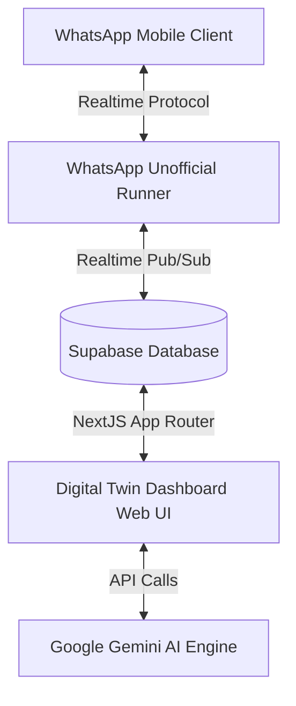

# Digital Twin — Hackathon Q&A & Interview Guide

This guide compiles potential questions, technical deep-dives, and structural details about the **Digital Twin** (formerly Sampark Desk) project. Use this to prepare for pitch presentations, judge evaluations, and technical QA rounds.

---

## 1. Product Concept & Pitch Questions

### Q1: What is the core problem Digital Twin solves?
**Answer:** 
Most WhatsApp business tools use rigid, robotic templates that sound cold and artificial, alienating customers. Alternatively, human agents struggle to maintain a consistent tone across shifts. **Digital Twin** solves this by analyzing your past conversation histories (uploaded WhatsApp chats) and building an AI personal replica that replicates your exact vocabulary, tone, formality level, and emoji habits. It enables personalized, authentic auto-replies that vary depending on who you are talking to (e.g., father, brother, business client).

### Q2: Who is the target audience?
**Answer:**
- **SMBs & Solopreneurs:** Small business owners who want to automate customer outreach without losing their personal, brand-aligned touch.
- **Creators & Influencers:** Public figures seeking to automate engagement with fans in their signature voice.
- **Individuals:** People looking for a personal WhatsApp responder that adapts its tone automatically depending on whether a message comes from family, friends, or coworkers.

### Q3: What makes this unique compared to other WhatsApp CRMs?
**Answer:**
- **Dynamic Personality Matching:** Most CRMs only offer keyword-based trigger replies. Digital Twin mimics your linguistic style.
- **Context-Specific Tone Variation:** The AI doesn't send the same type of replies to everyone; it dynamically adjusts examples and personality settings based on the contact name (e.g. matching the specific warmth of talking to family vs. the professionalism of business clients).
- **Self-Hostable & Privacy-First:** Built to be run locally or self-hosted, keeping sensitive chat logs entirely under the user's control.

---

## 2. System Architecture & Technical Flow

### Q4: How does the unofficial WhatsApp runner work?
**Answer:**
We use a separate, lightweight Node.js microservice (`whatsapp-service/index.js`) powered by `whatsapp-web.js` and Chromium (via Puppeteer). 
- It spawns a headless browser session that acts as a WhatsApp Web client.
- When started, it generates a QR code, converts it to a base64 Data URL, and writes it to the Supabase `whatsapp_config` table.
- The React/Next.js dashboard listens to database changes in real-time, displaying the QR code for the user to scan.
- Once authenticated, session state is persisted locally inside the runner's filesystem (`.wwebjs_auth/`) so the connection survives restarts without scanning again.

### Q5: How is realtime message sync achieved between Next.js and the WhatsApp service?
**Answer:**
We use **Supabase Realtime Pub/Sub and Postgres Changes**:
1. When an incoming message arrives at the WhatsApp service, it inserts it into the Supabase `messages` table.
2. The Next.js chat interface has a live listener on the `messages` table and instantly updates the message thread in the UI.
3. When an agent sends a message from the Next.js UI, it is written to the database with a status of `sending`.
4. The WhatsApp runner listens to database insertions/updates in `messages`. When it detects a message with status `sending` and sender type `agent` or `bot`, it retrieves the recipient's phone number, sends it using the WhatsApp client, and updates the database row status to `sent`.

---

## 3. AI, Linguistics & Training Engine

### Q6: How does the AI learn the user's communication style?
**Answer:**
1. The user exports a WhatsApp chat without media as a `.txt` file and uploads it.
2. The [chat-parser](file:///c:/Users/LOQ/Desktop/chat/Sampark-Desk/src/lib/ai/chat-parser.ts) cleans and formats the timestamps, senders, and message texts.
3. The [pair-extractor](file:///c:/Users/LOQ/Desktop/chat/Sampark-Desk/src/lib/ai/pair-extractor.ts) searches for consecutive turns where an incoming message was answered by the target sender within a 12-hour window, pairing them as `incoming_message` -> `reply` training pairs.
4. When "Analyze Style" is triggered, the training pairs are formatted and sent to the **Google Gemini API** (using `gemini-1.5-flash` or similar models) along with a structured prompt.
5. Gemini performs a linguistic style analysis and returns a profile containing formality scales, average reply length, vocabulary words/phrases, Hinglish/language mixtures, and emoji habits, saving it as a `personality_profile` row in the database.

### Q7: How does contact-specific tone matching work?
**Answer:**
- When uploading a chat export, the user can optionally write the WhatsApp contact name (e.g. `Father`, `Friend`). All extracted training pairs are associated with that name.
- When generating a reply, the system queries the contact's name for the active conversation.
- If a contact-specific profile exists (e.g. a profile saved under `contact_name = 'Father'`), it is loaded instead of the general profile.
- The reply engine queries and feeds example training pairs filtered strictly by `contact_name = contactName` into the LLM context.
- Gemini receives examples of how the user previously interacted with *that specific person*, adapting its vocabulary and tone to match.

### Q8: What is the fallback auto-reply mechanism?
**Answer:**
If an incoming message is received from a contact for whom no specific chat has been uploaded:
- The system loads the user's **General (Default)** personality profile.
- It queries the database for general training pairs (`contact_name IS NULL`) to retrieve style examples.
- This ensures the AI always responds in the user's general communication voice rather than failing or skipping the auto-reply.

---

## 4. UI/UX & Styling

### Q9: Describe the design system and styling choice.
**Answer:**
We migrated the application to a high-end, premium **BMW Corporate Design Language**:
- **Palette:** Pure white canvas (`#ffffff`), dark navy panels (`#1a2129`), and sharp BMW Blue actions (`#1c69d4`).
- **Shapes:** Clean, flat **rectangular styling** with `0px` border radiuses (`rounded-none`). Rounded elements and drop shadows are avoided to convey engineered precision.
- **Typography:** Strong contrast using heavy 700-weight display headings alongside light 300-weight body text, creating an editorial, premium look.

---

## 5. Scalability & Production-Readiness

### Q10: Since you are using an unofficial WhatsApp API, how do you prevent account bans?
**Answer:**
Bans typically happen due to automated bulk spamming or bot-like behavior. We mitigate this with:
- **Heuristic Delay:** Messages sent by the bot can include synthetic delays (e.g., simulating typing speed).
- **Human-like Timing:** Avoid sending responses within milliseconds; instead, auto-replies queue and execute with randomized offsets.
- **Strictly Conversational Use:** The bot only replies to active, inbound conversations rather than cold-outbounding.

### Q11: What database optimizations have been implemented?
**Answer:**
- **Bulk Chunked Inserts:** Uploaded chats can contain thousands of messages. The upload endpoint writes records in chunks of 200 to prevent Supabase payload limits or gateway timeouts.
- **Postgres Indexes:** Added indexes on `training_pairs` (`user_id`, `upload_id`) and a coalesce-based unique index `idx_personality_profiles_user_contact_coalesce` on `(user_id, COALESCE(contact_name, ''))` for quick constraint evaluation and queries.

---

## 6. Tech Stack, Implementation & Tool Choices

### Q12: Which languages and frameworks are used in the frontend and backend?
**Answer:**
* **Frontend Language & Framework**: **TypeScript + React** using the **Next.js App Router** framework. This enables static optimizations, server-side pre-rendering (SSR) for speed, and structured React component design.
* **Backend Language & Framework**: **TypeScript + Node.js** executing inside Next.js Serverless Route Handlers.
* **WhatsApp Microservice**: **JavaScript + Node.js** running a persistent runtime environment to control the headless Chromium browser via `whatsapp-web.js` / Puppeteer.
* **Database Querying**: Fully typed SQL queries via the **Supabase JavaScript Client SDK** on both client components and server routes.

### Q13: Why did you choose Supabase as your backend service?
**Answer:**
* **PostgreSQL Base**: It provides a full, uncompromised Postgres database, allowing custom unique constraints, complex join queries, and database triggers.
* **Realtime Synchronization**: Realtime Pub/Sub is crucial. The chat UI listens to inserts/updates in the `messages` table and refreshes the screen instantly when the WhatsApp bot or agent sends a message.
* **Built-in Authentication**: Next.js middleware is seamlessly integrated with Supabase Auth cookies, allowing easy profile correlation via Postgres foreign keys.
* **No-Code / Rapid Prototyping**: Supabase Auto-generates REST APIs directly from the SQL schema, letting us focus on core logic (Gemini reply engine, parser, scraper) rather than writing boilerplate API layers.

### Q14: How is the visual automation builder implemented?
**Answer:**
* **No-Code Canvas (Frontend)**: Built using React flow states, mapping visual trigger nodes (like `new_message_received`, `keyword_match`) to action sequences (e.g. `send_message`, `add_tag`, `wait`).
* **Workflow Engine (Backend)**: When a WhatsApp message triggers an automation, the engine executes action sequences. For `wait` delays, it inserts a delayed row into `automation_pending_executions` which a cron runner picks up and executes later.

### Q15: How does the system handle concurrent database writes during message floods?
**Answer:**
* We enforced unique constraint indexes on `contacts(user_id, phone)` and `conversations(user_id, contact_id)`.
* In `whatsapp-service/index.js`, all incoming contact/conversation creations utilize PostgreSQL `.upsert()` with `onConflict` clauses instead of naive insertions. If duplicate writes happen concurrently, Postgres safely merges them, preventing duplicate rows and keeping the live chat inbox clean and single-threaded.

